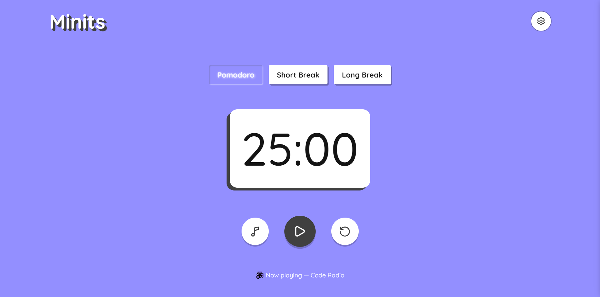

<div align="center">

# [Minits]()

A fun and easy-to-use Pomodoro timer to make work enjoyable.



</div>

## ✨ Features

- Pause and resume timer functionality
- Set customizable work/break session durations
- Reset the timer to start a new session at any time
- Auto-start next session
- Customize color themes and choose dark mode
- Audio and/or visual notification at the end of each session
- Play ambient music during sessions, with a "Now playing" display
- Settings data is stored in local storage
- Install the app with a single click as a [progressive web app](https://developer.mozilla.org/en-US/docs/Web/Progressive_web_apps)
- Fully responsive design for optimal display on most devices.

## 🧰 Tech used

- HTML
- CSS
- JavaScript
- Webpack
- Figma
- Audacity

## 💻 Setup Locally

Clone the project

```bash
  git clone https://github.com/buneeIsSlo/Minits.git
```

Go to the project directory

```bash
  cd Minits
```

Install dependencies

```bash
  npm install
```

Start the development server

```bash
  npm run dev
```

Build and compile

```bash
  npm run build
```

## 🛣 Roadmap

- [ ] Display session progress with a progress bar or other visual indicator
- [ ] Set customizable number of work/break sessions before a long break
- [ ] Add more ambient music or integrate Spotify

## 🌈 Inspiration

I follow the Pomodoro technique and it has been instrumental in helping me manage my time and stay focused on my work.
I also enjoy listening to ambient music while I work, so I realized that developing a Pomodoro timer that integrates my preferred music would be a great way to make my work more enjoyable and productive.

## 📜 License

[MIT](https://choosealicense.com/licenses/mit/)

## 💙 Acknowledgements

- I took a lot of inspiration from timers that are already out there, here are some prominent ones: [Tomato Timer](https://www.toptal.com/project-managers/tomato-timer), [Pomofocus.io](https://pomofocus.io/), and [pomdorotimer.online](https://pomodorotimer.online/)
- The design of the app is inspired by [this figma design](https://www.figma.com/file/N7ybUfkKC2FUGZwQpsSftv/appt-scheduler?node-id=0%3A1&t=5BGIKD8Zg0m6ImI7-0).

<hr>

<div align="center">

<strong>⭐ Leave a star maybe? ⭐</strong><br>

<a href="https://github.com/buneeIsSlo/Minits">Source</a>
| <a href="https://twitter.com/slo_bunee" target="_blank">Twitter </a>
| <a href="https://www.linkedin.com/in/bunee-dev/" target="_blank">LinkedIn </a>
| <a href="https://github.com/buneeIsSlo" target="_blank">Other Projects</a>

</div>
